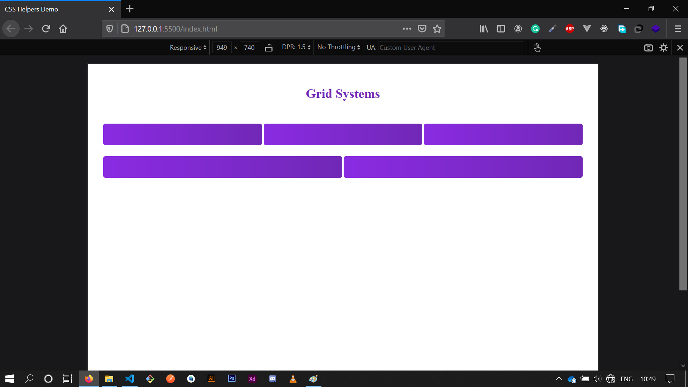

# **Library for starting web project**

### **Features :**

1. **JavaScript Helper for client operation**
    1. Selecting element easily.
    2. Showing and hiding elemnt easily.
    3. Clicking element easily.
    4. Manage classes of element easily.
    4. Manage attributes of element easily.
    4. Add styles to element easily.
    4. Add an event to element easily.

2. **CSS Helper for styling**
    1. Grid Systems support.
    2. Margin and padding helper classes.
    3. Theme preferences.

<br><br>

# Javascript Helpers

This javascript helper is the **_()** function that can help us to manage element in javascript.

<br>

### **Available Methods**

- **_.get()_** method, to get the selected element.

- **_.click()_** method, to click the selected element.

- **_.hide()_** method, to the selected element disappear.

- **_.show()_** method, to make the selected element appear.

- **_.addClass()_** method, to add new class to the selected element.

- **_.removeClass()_** method, to remove existing class in the selected element.

- **_.toggle()_** method, to toggle a class in the selected element.

- **_.attribute()_** method, to manage (_get and set_) attributes of the selected element.

- **_.style()_** method, to add **a style** to the selected element.

- **_.styles()_** method, to add **some styles** to the selected element.

- **_.on()_** method, to add **any event** to the selected element.

- **_.onClick()_** method, to add a new **click event** to the selected element.

- **_.onHover()_** method, to add a new **mouseenter event** to the selected element.

- **_.onUnhover()_** method, to add a new **mouseout event** to the selected element.

- **_.removeEvent()_** method, to remove existing event in the selected element.

<br>

## **Usage**

#### **Select and get element**
In order to select an element using this helper, use this code below :

```js

/* _(cssScelector) */

// For example
_(".nav-bar")

```

This is just like **_document.querySelector("cssSelector")_**. They are technically the same. But, The result are not the same. The result has many methods you can run to. For example :

```js

_("div").get() // to get the selected element.

```

**But, keep in mind**. As default, the **.get()** method always returns only **one active element**. It means that only the first selected element will be returned. For example in the previous code :

```js

_("div").get() // this returns only the first selected element.

```

and it will also effect to all of the available methods, running for only the active element. If you want to change this behavior, set all of the selected elements to be an active state, by passing an option like this:

```js

_("div", { all: true }).get() // 'all' default value is false

```

#### **Hide and show element**

```js

// hide element
_(".sidebar").hide()

// show element
_(".sidebar").show()

```

#### **Click element**

```js
// click element
_("#btn").click()
```

#### **Manange classes of element**

```js

// add new class
_("button").addClass("btn-secondary")

// remove an existing class
_("button").removeClass("btn-secondary")

// toggle a class
_("button").toggle("isClicked")

```

#### **Manange classes of element**

```js

// get value of attribute named class
console.log(_("button").attribute("class"))

// set attribute named class to "newClass"
_("button").attribute("class", "isClicked")

```

#### **Add styles to element**

```js

// set a style
_("button").style("color", "aliceblue")

// set some styles
_("button").styles({
   backgroundColor: "blue",
   color: "white",
   fontSize: "2rem"
})

```


#### **Add styles to element**

```js

// add on click event
_("button").onClick(e => alert("clicked."))

// add on mouse enter event
_("button").onHover(e => alert("Mouse enter."))

// add on mouse out event
_("button").onUnhover(e => alert("Mouse out."))

// add any event to the element
_("button").on("click", e => alert("Clicked."))


// remove existing event
function callback(e) {
  console.log(e)
}

_("button").onClick(callback)

_("button").removeEvent("click", callback)

```

<br><br>

# CSS Helpers

CSS Helper is css library contains a bunch of classes ready to use, like py-2 to indicate that the element has **_padding-top)** and **_padding-bottom_** with the value is 2 (could be _2rem_, _2px_, _2%_, etc).

For example, in **_index.html_** file we have a bunch of lines of code as below :

```html

<!DOCTYPE html>
<html lang="en">

<head>
  <meta charset="UTF-8">
  <meta name="viewport" content="width=device-width, initial-scale=1.0">
  <link rel="stylesheet" href="./public/css/style.css">
  <title>CSS Helpers Demo</title>

  <style>
    h2 {
      color: rgb(113, 40, 182);
      text-align: center;
    }

    .box {
      width: 100%;
      min-height: 40px;
      background-image: linear-gradient(to right, blueviolet, rgb(113, 40, 182));
      border-radius: 4px;
    }
  </style>
</head>

<body>
  <div class="container">
    <h2 class="my-4">Grid Systems</h2>

    <div class="row">
      <div class="col-md-3">
        <div class="box"></div>
        <div class="box"></div>
        <div class="box"></div>
      </div>
    </div>
    <div class="row my-2">
      <div class="col-md-2">
        <div class="box"></div>
        <div class="box"></div>
      </div>
    </div>
  </div>
</body>

</html>

```

**The results are :**



<br>

## **Usage**

#### **Grid systems**

```html

<!-- 2 columns in small screen -->

<div class="row">
  <div class="col-sm-2">
    <div class="box"></div>
    <div class="box"></div>
  </div>
</div>


<!-- 4 columns in large screen -->
<!-- 2 column in medium screen -->
<!-- 1 column in small screen -->

<div class="row">
  <div class="col-lg-4 col-md-2 col-sm-1">
    <div class="box"></div>
    <div class="box"></div>
    <div class="box"></div>
  </div>
</div>


<!-- available columns are up to 11 -->

<div class="row">
  <div class="col-sm-11">
    <div class="box"></div>
    <div class="box"></div>
    <div class="box"></div>
  </div>
</div>


<!-- available media screen are sm, md, lg, and xl -->

<div class="row">
  <div class="col-sm-2 col-md-4 col-lg-8 col-lg-8">
    <div class="box"></div>
    <div class="box"></div>
    <div class="box"></div>
    <div class="box"></div>
    <div class="box"></div>
    <div class="box"></div>
    <div class="box"></div>
    <div class="box"></div>
  </div>
</div>


<!-- if you want to use 12 columns, -->
<!-- use col-sm, col-md, col-lg, and col-xl -->

<div class="row">
  <div class="col-xl">
    <div class="box"></div>
    <div class="box"></div>
    <div class="box"></div>
  </div>
</div>

```

<br>

#### **Margin and Padding**

```html

<!-- MARGIN -->

<div class="my-2">
  
</div>

<div class="mx-3">
  
</div>


<!-- Margin top, right, bottom, and left -->

<div class="mt-2 mr-2 mb-3 ml-1">
  
</div>


<!-- PADDING -->

<div class="py-1">
  
</div>

<div class="px-4">
  
</div>


<!-- Padding top, right, bottom, and left -->

<div class="pt-2 pr-2 pb-3 pl-1">
  
</div>

```